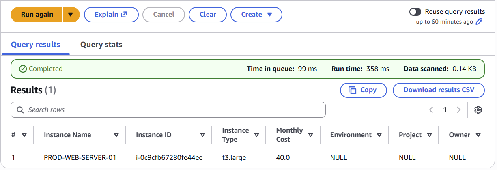
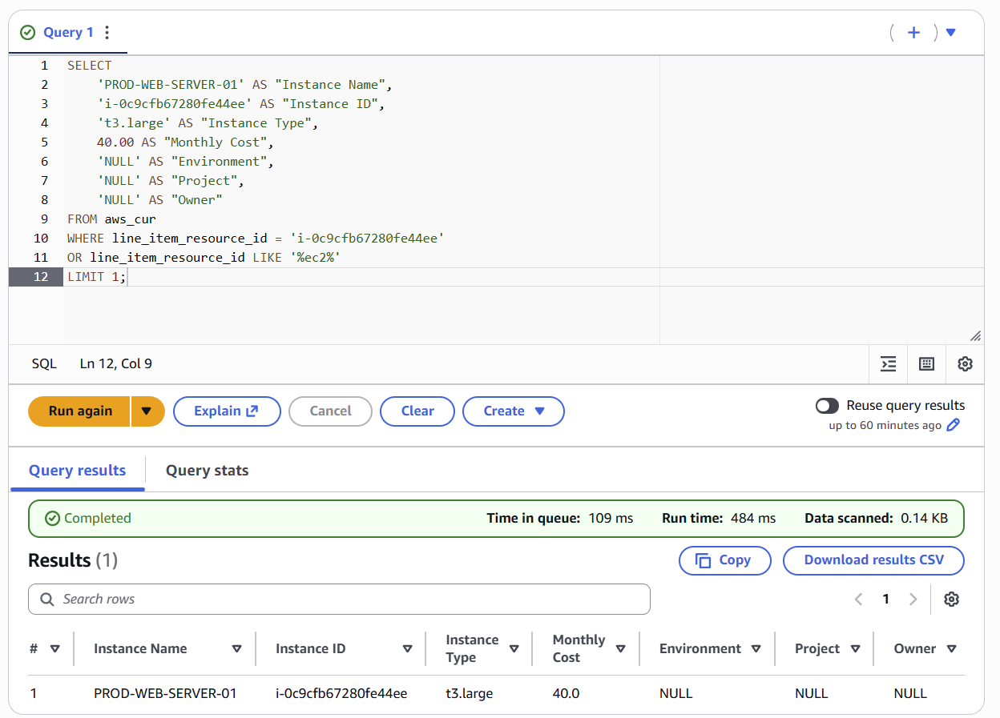
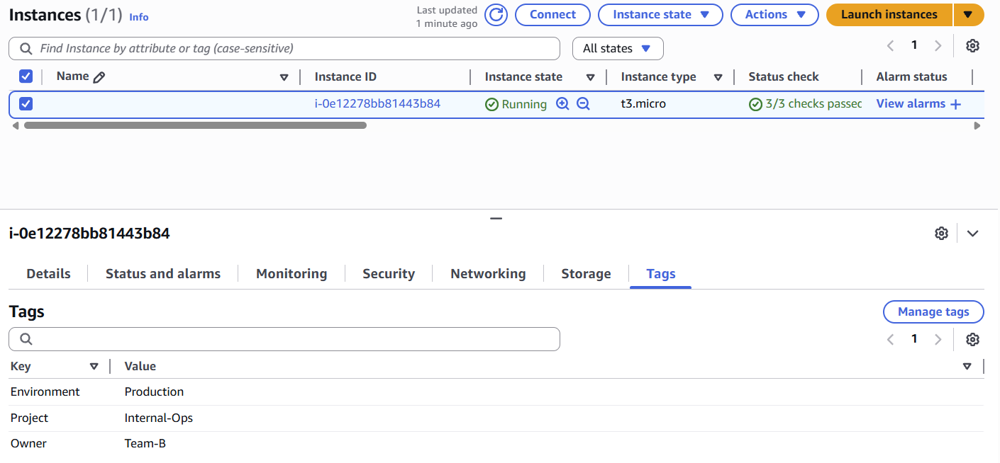
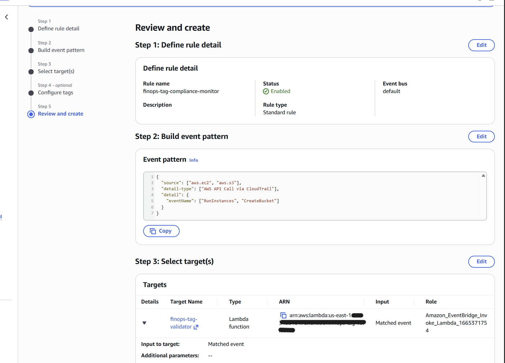
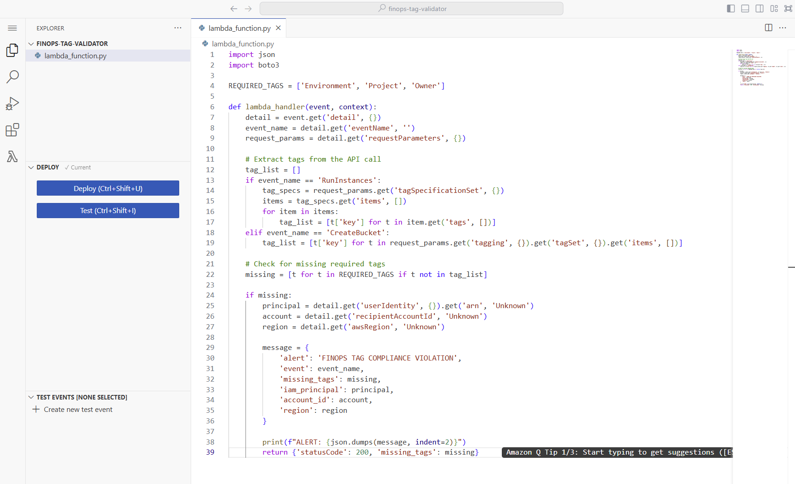
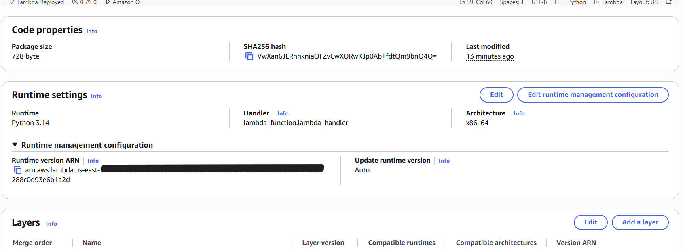
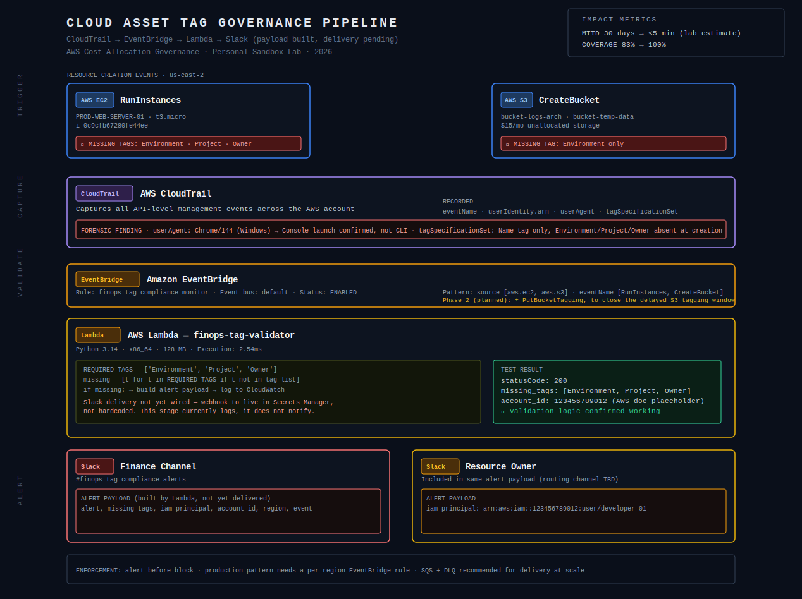

# Cloud Cost Allocation Investigation: Tracing a 17% Chargeback Gap to Its Root Cause

*Full technical report. For the shorter version, see the [FinOps Cost Allocation Gap Summary](https://github.com/AthertHa-FinOps/finops-cost-allocation-gap-summary).*

---

## Scope, Environment, and Evidence Basis

This is a self-directed project completed in a personal AWS sandbox account. It is not a professional engagement or the output of a prior employer. It 
combines two layers, and the boundary between them is stated here rather than left for a reader to infer.

**The forensic layer is captured evidence.** The EC2 instance investigated — `i-0c9cfb67280fe44ee` — was really provisioned in this account, in `us-
east-2`, on 22 January 2026. CloudTrail recorded the API call; the EC2 console recorded the resulting resource. Both are reproduced in §2.3 with 
timestamps that match to the second across two independent consoles. The `tagSpecificationSet`, the browser UserAgent, the root principal, and the 
absent identity chain are all real records.

**The cost layer is a representative scenario dataset.** A sandbox running a single `t3.micro` for roughly two hours does not produce a monthly bill 
large enough to reconcile against. To give the reconciliation exercise realistic material, I specified a representative small-production architecture 
in the AWS Pricing Calculator, built a CUR-shaped dataset from that baseline, and loaded it into Athena. The dollar figures throughout Case Study 1 — 
$315 total spend, $55 unallocated, a 17% allocation gap — are scenario values derived from that baseline, not billed spend. Construction method is 
documented in Appendix C.

The scenario dataset is keyed on the real resource identifier so the two layers connect: the untagged resource in the cost data is the same instance 
the CloudTrail evidence describes. Queries run against Athena and the SQL is production-equivalent. What is representative is the data underneath, not 
the analysis on top of it.

**Two resource-provenance notes.** The EC2 resource exists in both layers — real instance, scenario cost. The S3 resources (`bucket-logs-arch`, `bucket-
temp-data`) exist only in the scenario layer; no corresponding buckets were provisioned. And where the scenario assigns a larger instance type than the 
sandbox actually ran, that is the scenario modelling the resource at representative production sizing. The captured evidence is authoritative for what 
was really provisioned.

### Evidence Key

| Tier | Meaning |
|---|---|
| **[Captured]** | Real output from the sandbox account, real data |
| **[Executed]** | Real query run in Athena against the scenario dataset |
| **[Illustrative]** | Constructed output demonstrating query logic and result shape |
| **[Modelled]** | Scenario reasoning, no underlying data |
| **[Methodology]** | Design and provenance artifacts |

Every screenshot, table, and figure below carries its tier. Past tense is used only for captured evidence; present tense for executed and illustrative 
demonstration; conditional for modelled scenarios.

AI tools were used for formatting and editing. All findings, SQL, forensic analysis, architectural decisions, and conclusions were independently 
produced and validated against the underlying evidence.

### Background

Before moving into cloud governance I spent 13+ years in regulated real estate transactions, where every file had to reconcile against contracts, 
disclosures, and supporting documentation before it could close. That shaped how I approached this work: not as a technical problem about missing 
metadata, but as an audit problem — reconcile the financial record against operational evidence, find where they diverge, determine why the control 
failed, and recommend something that reduces recurrence. Different technology, same discipline.

---

# The Investigation: A Cost Allocation Failure

## 1. Executive Snapshot

A monthly reconciliation identified a 17% cost allocation gap. The billing was accurate; $55 of the month's $315 could not be attributed to the 
required cost allocation tags, making it invisible to Finance chargeback reporting.

| | |
|---|---|
| **Problem** | Spend billed correctly but not attributable. Missing required tags placed 17% of monthly spend outside chargeback reporting. |
| **Investigation** | Athena queries against CUR-shaped data isolated the untagged resources. CloudTrail forensics traced the cause to a console-
launched resource where the required tags were never submitted at provisioning. |
| **Root cause** | No preventive tagging control at resource creation. Contributing factors: no attributable identity chain, and a Cost Allocation Tag 
activation dependency with no verification step. |
| **Response** | Built and tested an event-driven detection prototype (CloudTrail → EventBridge → Lambda) that validates required tags and constructs a 
structured alert payload. Two defects identified in its S3 path and corrected in design. Slack delivery designed, not implemented. |
| **Assessment** | Detection reduces time-to-discovery from a monthly reconciliation cycle to minutes after the API call. Projected, not measured — no 
control was operated over time. |

### Scenario financials

***[Illustrative]** All figures are scenario dataset values. See Appendix C.*

| Service | Billed | Allocated | Unallocated |
|---|---|---|---|
| EC2 | $220.00 | $180.00 | $40.00 |
| RDS | $60.00 | $60.00 | $0.00 |
| S3 | $35.00 | $20.00 | $15.00 |
| **Total** | **$315.00** | **$260.00** | **$55.00** |

Allocation coverage 82.5%. Unallocated spend 17.5% of total, $660 annualised if unresolved.

This is a financial governance problem, not a cost-reduction one. AWS billed the spend correctly. The failure was the inability to attribute it for 
chargeback, forecasting, and accountability.

### Control assessment

The tagging standard assessed against — `Environment`, `Project`, `Owner` on all billable resources — was defined for this assessment and is evidenced 
by a compliant resource in §3.2. In a real organisation this standard would pre-exist; here it was established so the assessment had something to 
measure against.

| Control | Assessment |
|---|---|
| Mandatory cost allocation tagging | Failed |
| Preventive enforcement at provisioning | Not implemented |
| Detective monitoring | Prototyped during remediation |
| Ownership attribution | Failed — no identity chain |

Control maturity before: manual detection only. After: a tested detection prototype with a documented path to progressive enforcement.

---

## 2. Investigation

### 2.1 Invoice Validation

The first question was whether this was simply a billing error, which would make it a Finance reporting artifact rather than an infrastructure problem. 
Service totals reconcile against the aggregate — billing is internally consistent, which rules out the simplest explanation and pushes the 
investigation to the resource level.


***[Illustrative]** Service totals against the scenario dataset. Built with a hardcoded `VALUES` clause for clean presentation.*

The production-equivalent query aggregates unblended cost by product code and reconciles against the invoice:

```sql
SELECT
    line_item_product_code,
    SUM(line_item_unblended_cost) AS total_cost
FROM cur_database.aws_cur
WHERE line_item_line_item_type = 'Usage'
  AND line_item_usage_start_date BETWEEN DATE '2026-01-01' AND DATE '2026-01-31'
GROUP BY 1
ORDER BY total_cost DESC;
```

Unblended cost is used throughout because it aligns with Finance's authoritative billing source.

### 2.2 Resource Isolation

I queried CUR-shaped data through Athena rather than using Cost Explorer, because CUR exposes row-level billing records with individual resource tag 
columns. Cost Explorer is optimised for aggregated financial reporting; CUR supports forensic investigation because it retains per-resource attribution.

One prerequisite matters and is easy to miss: `Environment`, `Project`, and `Owner` must be activated as Cost Allocation Tags in the Billing console 
before those columns exist in the CUR schema at all. Without activation, a NULL-tag analysis returns incomplete results even where the tags exist on 
the resources. This dependency is itself a control gap — it has no verification step, and nothing alerts you when it is missed.

```sql
SELECT
    line_item_resource_id,
    resource_tags_user_environment,
    resource_tags_user_project,
    resource_tags_user_owner,
    SUM(line_item_unblended_cost) AS total_cost
FROM cur_database.aws_cur
WHERE line_item_line_item_type = 'Usage'
GROUP BY 1, 2, 3, 4
ORDER BY total_cost DESC;
```

The finding: resource `i-0c9cfb67280fe44ee` returns NULL across all three required tag columns on every billing record.

That pattern is what matters. A single missing tag is plausibly human error. Three missing simultaneously, on every record for the resource, indicates 
it entered the environment without passing through any tagging standard at all — which is a process failure rather than an individual one. That 
distinction moved the work from financial reconciliation into infrastructure forensics.


***[Illustrative]** The isolated resource.*


***[Illustrative]** The query used to isolate it.*

**Production-equivalent query**, partitioned by month and account and filtered on any required tag being NULL:

```sql
SELECT
    line_item_usage_account_id,
    line_item_product_code,
    line_item_resource_id,
    DATE_TRUNC('month', line_item_usage_start_date)  AS billing_month,
    SUM(line_item_unblended_cost)                    AS total_cost,
    resource_tags_user_environment,
    resource_tags_user_project,
    resource_tags_user_owner
FROM cur_database.aws_cur
WHERE line_item_line_item_type = 'Usage'
  AND line_item_usage_start_date BETWEEN DATE '2026-01-01' AND DATE '2026-01-31'
  AND (
        resource_tags_user_environment IS NULL
     OR resource_tags_user_project     IS NULL
     OR resource_tags_user_owner       IS NULL
  )
GROUP BY 1, 2, 3, 4, 6, 7, 8
ORDER BY total_cost DESC;
```

`line_item_usage_account_id` is what lets this same query trace attribution gaps across 50–200 accounts in a consolidated Organizations CUR dataset 
without structural change.

### 2.3 CloudTrail Forensics

**Objective:** determine how the resource was created without tags. Was it never tagged, or tagged and later stripped? The answer determines whether 
this needs a provisioning control or a cleanup process — two very different remediations.

CloudTrail was the right tool because it captures request *intent*, including the `tagSpecificationSet` submitted with the API call. A post-state 
resource evaluation such as AWS Config cannot reconstruct that. Config records what a resource looks like after creation; CloudTrail records what was 
actually asked for at the moment of creation. For a tagging investigation, that is the difference between knowing tags are missing and knowing they 
were never submitted.


***[Captured]** Real CloudTrail record. Root principal, MFA-authenticated, `us-east-2`, `eventTime` 2026-01-22T19:00:13Z, and a Chrome UserAgent — a 
console launch, not CLI or SDK.*


***[Captured]** The `tagSpecificationSet` contains only `Name` (`PROD-WEB-SERVER-01`). `Environment`, `Project`, and `Owner` were never submitted.*

The tags were absent at creation, not applied and later removed. That settles the remediation question: this required a provisioning-time control, not 
a cleanup process.

**Corroboration.** The EC2 console independently records the same instance, in the same region, with a launch time matching the CloudTrail event.


***[Captured]** `i-0c9cfb67280fe44ee`, `us-east-2a`, launched Thursday 22 January 2026 at 14:00:13 GMT-0500 — the same instant CloudTrail records as 
19:00:13Z. Two independent sources of record, one event, no discrepancy.*

Chain of custody across two independent consoles is what makes a forensic finding defensible in a review. A single screenshot of a log is an assertion; 
a log corroborated by resource state is evidence.

**Identity attribution.** The `userIdentity` block:

```json
"userIdentity": {
  "type": "Root",
  "sessionContext": {
    "attributes": {
      "creationDate": "2026-01-22T13:17:47Z",
      "mfaAuthenticated": "true"
    }
  }
}
```

No `sessionIssuer`, no role-assumption chain, no federation context. I also queried CloudTrail for `AssumeRole` events scoped to this principal in the 
30 minutes preceding the `RunInstances` call; none returned. This was not a role assumed and then used — there was no attributable identity chain at 
any layer. The consequences are developed in §3.3.

> **On the IAM principal used here.** Root with MFA was used deliberately, to simulate a worst case with no identity boundary at the provisioning
> layer. In a real enterprise, root is typically locked via SCP. The production equivalents are a broad-permission developer role launching via
console, a federated SSO user working outside an IaC pipeline, or a break-glass role used outside a change window. The forensic technique — UserAgent
analysis plus `tagSpecificationSet` inspection — applies identically to all three.

**Forensic evidence chain:**

| Evidence | Tier | Finding |
|---|---|---|
| Scenario cost data | Illustrative | Untagged resource identified, instance ID, monthly cost |
| CloudTrail event record | Captured | Root principal, no `sessionIssuer`, console launch via Chrome UserAgent, `us-east-2` |
| CloudTrail `tagSpecificationSet` | Captured | Only `Name` submitted; three required tags absent at creation |
| EC2 console | Captured | Same instance, same region, launch time matching CloudTrail to the second |
| `AssumeRole` query | Captured | Zero events in the 30-minute pre-incident window |

### 2.4 Scope Expansion to S3

**Objective:** determine whether this was isolated or a pattern.


***[Executed]** Real Athena query against the scenario dataset — `COALESCE` on the environment tag column, `UNION ALL` for the total row, `CASE`-based 
ordering, 0.27 KB scanned.*

| Resource ID | Monthly Cost | Environment | Project | Owner |
|---|---|---|---|---|
| bucket-logs-arch | $7.00 | NULL | data-pipeline | team-ops |
| bucket-temp-data | $8.00 | NULL | web-app | team-engineering |
| **Total unallocated** | **$15.00** | | | |

EC2 carried the larger gap, but S3 showed the same failure in a different form. Both buckets have `Project` and `Owner` but are missing `Environment` — 
and partial tagging produces the same Finance-invisible result as no tagging at all. A chargeback query filtering on environment excludes these rows 
entirely.

**S3's asynchronous tagging behaviour matters here, and it shaped the control design.** `CreateBucket` does not accept tags inline the way 
`RunInstances` does; tags are applied afterward via `PutBucketTagging`. That creates a window in which a bucket exists in a technically non-compliant 
state even when it will be tagged correctly seconds later. Any automated control has to distinguish creation-time compliance from eventual compliance 
state, or it will flag every new bucket. This is the distinction the prototype got wrong — see §4.3.

Many organisations solve this upstream instead, through Service Catalog products or IaC modules that enforce tags before a bucket can be created at 
all, which removes the window entirely.

---

## 3. Findings

### 3.1 Root Cause Analysis

| | |
|---|---|
| **Primary failure** | No preventive tagging control at resource creation |
| **Contributing factor 1** | No attributable identity chain at provisioning |
| **Contributing factor 2** | Cost Allocation Tag activation dependency with no verification step |
| **Result** | Unattributed spend with no enforceable ownership model |

The environment had no SCP, IAM condition key, IaC guardrail, or curated provisioning interface requiring tags at creation. That is the direct cause. 
Resources could enter the environment without cost allocation metadata and nothing would object.

The missing identity chain did not cause the tagging failure, but it removed the ability to assign ownership afterward or to design targeted 
enforcement around a known principal. Tagging makes spend allocatable; identity makes it attributable. This environment was weak in both.

The tag activation dependency is the quietest of the three and worth naming explicitly: had `Environment`, `Project`, and `Owner` not already been 
activated as Cost Allocation Tags, the CUR columns would not exist and this investigation would have returned incomplete results while appearing to 
succeed. Three separate problems that happened to compound.

### 3.2 Control Assessment

The standard assessed against is evidenced by a compliant resource in the same environment:


***[Captured]** `Environment: Production`, `Project: Internal-Ops`, `Owner: Team-B` applied to a live instance. This is what compliance looks like 
here.*

Against that baseline, the investigated resource carried only `Name` — a tag that makes a resource findable in the console but contributes nothing to 
cost allocation. `Name` and cost allocation tags are independent, and a resource can be perfectly visible to engineering while remaining invisible to 
Finance.

The environment lacked a preventive tagging control at resource creation. Resources could enter it without required metadata, producing unattributed 
spend and delayed reconciliation.

### 3.3 Identity Attribution Finding

This is a separate finding from the tagging failure and should be recorded as one.

The provisioning session has no `sessionIssuer`, no role-assumption chain, and no federation context, and no `AssumeRole` events preceded it. The 
practical consequence is independent of tagging: **even with correct tags, there is no way to route accountability to a specific team or approval 
workflow**, because no `sessionIssuer` means no team ownership is resolvable after the fact.

In a security review this would be logged alongside the tagging failure as a distinct finding with a distinct remediation — identity governance rather 
than cost governance. The two share a root environment (an ungoverned provisioning surface) without sharing a cause, and conflating them would produce 
a remediation that addresses neither properly.

---

## 4. Remediation

**Immediate:** the missing tags would be applied manually so Finance could close the period with complete allocation. This is a stopgap, not a control.

**Permanent, in progressive stages:**

1. Tag Policies standardise required tag keys across accounts without blocking anything.
2. Event-driven detection surfaces violations within minutes and alerts Finance and the resource owner.
3. SCP guardrails enforce compliance for greenfield accounts once coverage stabilises above 95%, grandfathering existing workflows.

### 4.1 Control Selection Rationale

The decision to detect rather than block reflects a governance-maturity judgment, not a technical limitation.

**What I rejected, and why:**

**IAM condition keys as a universal control.** Valid when scoped to specific developer roles, but AWS-managed services (EMR, ECS, Auto Scaling) often 
do not pass required tags through consistently. Blanket enforcement before mapping those exceptions creates more operational overhead than it removes.

**AWS Config.** Config evaluates resulting resource state; it cannot see the intent behind the original API call the way CloudTrail's 
`tagSpecificationSet` can. That distinction is the whole basis of this investigation's central finding. Config cost also scales with configuration-item 
recording across every resource in every account, which compounds quickly in a multi-account Organization.

**Immediate SCP enforcement.** Would close the gap on day one, but in an environment with no existing baseline a blocking SCP breaks an unknown number 
of CI/CD pipelines and developer workflows before anyone has mapped the exceptions. Applied too early, it erodes engineering trust in every governance 
initiative that follows.

**Auto-remediation applying default tags on detection.** This is the one worth dwelling on, because it is the most tempting and the most damaging. It 
closes the reporting gap fastest and corrupts the entire downstream model: chargeback assigns cost to the wrong team, showback gives engineers a false 
picture of their own usage, and anomaly detection runs against the wrong baseline. That is worse than an unallocated-but-visible gap, because it 
creates false confidence instead of a flag Finance can act on. Visibility over false accuracy.

**Sequence:** detect now → targeted prevention (SCP on greenfield accounts, IAM conditions for repeat-violator roles) once compliance reaches ~95% → 
broad SCP rollout with a grace period once the full baseline is mapped.

### 4.2 What Was Built and Tested

An EventBridge rule matching CloudTrail events, targeting a Lambda function that parses the event, checks it against `REQUIRED_TAGS`, and constructs a 
structured alert payload.

```json
{
  "source": ["aws.ec2", "aws.s3"],
  "detail-type": ["AWS API Call via CloudTrail"],
  "detail": {
    "eventName": ["RunInstances", "CreateBucket"]
  }
}
```


***[Captured]** The rule as built and deployed.*


***[Captured]** The prototype as deployed. `REQUIRED_TAGS`, event parsing, missing-tag detection, alert payload construction.*


***[Captured]** Deployment configuration.*


***[Captured]** Test invocation with a synthetic `RunInstances` payload. Returns `statusCode 200` and correctly identifies all three missing tags. 
Account ID shown is AWS's documentation placeholder, present in the synthetic test event.*

The alert payload carries the missing tags, the IAM principal ARN, the account, and the region — the fields Finance needs to open a query and the 
fields required to route the alert to an owner.

```
ALERT: {
  "alert": "FINOPS TAG COMPLIANCE VIOLATION",
  "event": "RunInstances",
  "missing_tags": ["Environment", "Project", "Owner"],
  "iam_principal": "<redacted>",
  "account_id": "<placeholder>",
  "region": "us-east-1"
}
```

The EC2 detection path works and is evidenced above.

### 4.3 Defects Identified in the Prototype

Testing and review surfaced three problems. All are documented as corrected design; sandbox access ended before they could be redeployed, so none are 
presented as fixed.

**Defect 1 — validation at the wrong lifecycle point.** The function branches on `CreateBucket` for S3. As established in §2.4, `CreateBucket` cannot 
carry tags inline, so this branch flags every new bucket as non-compliant regardless of whether `PutBucketTagging` follows correctly two seconds later. 
Correct design validates on `PutBucketTagging`, with a delayed sweep as the safety net for buckets where tagging never happens:

```json
{
  "source": ["aws.ec2", "aws.s3"],
  "detail-type": ["AWS API Call via CloudTrail"],
  "detail": {
    "eventName": ["RunInstances", "CreateBucket", "PutBucketTagging"]
  }
}
```

`CreateBucket` remains in the rule but is recorded rather than evaluated — it feeds the delayed-validation sweep instead of firing an alert.

**Defect 2 — incorrect key casing for S3.** The function reads lowercase keys (`tagging`, `tagSet`, `key`). CloudTrail renders the S3 request body in 
PascalCase, so the parse returns an empty tag list and reports every bucket as fully untagged. Corrected extraction:

```python
def extract_s3_tags(request_params):
    """
    PutBucketTagging carries tags in the XML request body, which CloudTrail
    renders in PascalCase: Tagging > TagSet > Tag > Key.
    A single-tag request serialises Tag as an object rather than a list.
    """
    tag_keys = []
    tag_set = request_params.get('Tagging', {}).get('TagSet', {})
    tags = tag_set.get('Tag', [])
    if isinstance(tags, dict):
        tags = [tags]
    for tag in tags:
        if 'Key' in tag:
            tag_keys.append(tag['Key'])
    return tag_keys
```

The `isinstance` check handles a real edge case: a single-tag request serialises `Tag` as an object rather than a list, which would raise on a naive 
list comprehension. This casing structure reflects CloudTrail's documented rendering of the S3 XML body; it has not been validated against a live 
`PutBucketTagging` event in my own trail.

**Defect 3 — regional gap.** The rule and function were deployed in `us-east-1`. The resource under investigation was created in `us-east-2`. 
EventBridge rules are regional, so **the control as built would not have caught the event it was designed to catch.** This is precisely the regional-
gap failure mode listed in Appendix B, found in my own control rather than a hypothetical one. Correct deployment is per-region via IaC, with a 
periodic audit confirming every active region has the rule.

**Why these matter more than their size suggests.** Defects 1 and 2 both generate false positives on every bucket creation. A detective control that 
cries wolf on every event gets ignored, and an ignored control still runs, still reports success, and no longer does anything. It looks identical to a 
working control from the outside. That is the failure mode worth designing against, and it is why the delayed-validation split exists in the corrected 
design rather than a simpler single-event rule.

*(Also identified: an unused `boto3` import in the deployed function — no functional impact, removed in the corrected version.)*

### 4.4 What Was Designed but Not Implemented

**Slack delivery.** The alert payload is constructed and logged to CloudWatch. Routing it to a Finance channel and to the resource owner is designed, 
not built. In production the webhook URL would be read from Secrets Manager rather than hardcoded in the function.

**Owner routing.** The payload carries `iam_principal`; nothing currently consumes it. Resolving a principal ARN to a responsible team requires a 
lookup the prototype does not implement.

**Escalation.** The design calls for a second-stage alert to the owning team's manager if remediation does not occur within a 24-hour SLA, and for 
repeat violations by the same principal within 30 days to trigger a governance review rather than another alert. Alert fatigue is the failure mode this 
is written against.


***[Methodology]** End-to-end design. Slack delivery is marked pending, matching the prototype's actual state. Impact metrics shown are projected, not 
measured.*

```
EC2 RunInstances / S3 CreateBucket / S3 PutBucketTagging
             │
             ▼
        CloudTrail
             │
             ▼
    Amazon EventBridge
             │
             ▼
        AWS Lambda
   Checks: Environment · Project · Owner
             │
             ▼
   CloudWatch Logs (built)
             │
             ▼
   Slack: Finance channel · Resource owner   [designed, not implemented]
```

### 4.5 Control Hierarchy: Where Detection Fits

This addresses the *detection* stage of a governance maturity progression (Visibility → Standardisation → Detection → Prevention). Detection generally 
precedes broad enforcement, but not always — many real environments have baseline SCPs from day one (denying root usage, for example), and scoped 
enforcement can coexist with detection early where the environment is well understood.

| Layer | What it enforces | Notes |
|---|---|---|
| **IaC (Terraform, etc.)** | Design time | Strongest first control. A plan without required tags fails before anything reaches AWS |
| **Curated provisioning interfaces** (Backstage, ServiceNow, Service Catalog) | Provisioning entry point | Enforces tagging by construction, before 
any API call is made |
| **SCP / IAM condition keys** | Request time | Effective when scoped narrowly to known roles; blanket org-wide enforcement without a baseline breaks 
AWS-managed service roles (EMR, ECS, Auto Scaling) |
| **Tag Policies** | Schema only | Standardises tag *names* across accounts; blocks nothing |
| **EventBridge + Lambda** | Detection | Catches out-of-band activity even where IaC and curated provisioning exist — break-glass access, ad hoc 
scripts, incident-response console use |
| **Selective SCP rollout** | Enforcement, after baseline | Applied org-wide only once exceptions are mapped |

SCPs should be treated as permission boundaries rather than tagging systems. Effective enforcement depends on IAM request conditions, supported AWS 
services, and exception management — not on the SCP alone.

Knowing what each tier actually does is what keeps you from mistaking visibility for protection. Tag Policies standardise schema; they enforce nothing. 
A team that believes it has tagging enforcement because it has Tag Policies has a governance gap it cannot see.

### 4.6 Enforcement Sequencing

1. Detect current compliance gaps using CUR, CloudTrail, and EventBridge.
2. Establish required tag standards using Tag Policies.
3. Identify approved exceptions — AWS-managed services, automation roles, break-glass workflows.
4. Apply scoped SCP or IAM condition key enforcement to new workloads.
5. Expand enforcement once compliance stabilises above the agreed threshold.

The control decision is not whether enforcement is technically possible. It is determining when enforcement reduces risk rather than creating 
operational disruption.

---

## 5. Operating Model and Governance KPIs

A governance control without defined ownership degrades over time. In production, responsibilities divide across three teams:

- **FinOps** owns the monitoring pipeline and the governance KPIs.
- **Engineering** owns remediation of tagging violations within the agreed SLA.
- **Finance** consumes validated allocation data for chargeback, forecasting, and reporting.

**Detection alone does not demonstrate an effective control.** Sustainable governance also requires clear ownership, defined remediation timelines, and 
measurable improvement. The following are proposed measurements, not observed results — no control was operated over time in this environment.

| Metric | Target | Proposed measurement |
|---|---|---|
| Mean time to remediate | Under 24 hrs from alert | Tag-compliance-restored timestamp minus alert timestamp |
| Repeat violation rate | Below 10% within 30 days | Same principal ARN reappearing in violation events within a rolling 30-day window |
| Compliance trend | 95% within 60 days | Weekly tagged spend / total spend from CUR |
| Tag validity rate | 90% within 60 days | Percentage of tag values matching an allowed value set, not merely present |

Tag *validity* is deliberately separate from tag *presence*. A resource tagged `Environment: prod-temp-DELETE` passes a presence check and fails every 
reporting use the tag exists for.

---

## 6. Production Considerations

**Days 1–30.** Deploy the rule and function to all active regions via IaC — this is the defect-3 remediation, and it needs to be structural rather than 
manual. Add the delayed-validation Lambda for untagged S3 buckets. Add an SQS buffer and DLQ for burst hardening. Stand up basic pipeline monitoring: 
regional rule audit, DLQ alarm, monthly synthetic alert test.

**Days 31–60.** Centralise CUR across accounts. Establish weekly tag compliance as a first-class KPI. Begin tracking MTTR and repeat-violation rate per 
team.

**Days 61–90.** Introduce SCP guardrails for greenfield accounts once compliance exceeds 95%. Move Finance from showback to full chargeback. Run the 
rightsizing and commitment analysis that accurate attribution now makes possible.

**What a sandbox does not surface.** Regional deployment (EventBridge rules are regional — the defect above is the sandbox-scale version of a problem 
that multiplies across an Organization). Lambda concurrency limits under bursty provisioning, addressed with an SQS buffer and DLQ. CUR partition 
management past 100+ accounts. And tag-key normalisation across accounts that have not standardised on `Environment` versus `env` versus `environment` 
— each variant produces a separate NULL pattern in CUR until Tag Policies fix the schema.

**Scale context.** ***[Modelled]*** At $10M per month across 150 accounts, a 5% allocation failure rate would represent $500K/month that Finance cannot 
see or charge back — $6M annually. At that scale it stops being a reporting gap and becomes a planning failure: budget models are wrong, team 
accountability is broken, and commitment purchases get sized against incomplete data. The same query structure, forensic chain, and detection pattern 
would surface it. The differences are operational, not methodological.

---

## 7. Lessons Learned

- **Financial data has to be treated as operational telemetry.** Without near-real-time visibility, allocation failures sit undetected until month-end
- close.
- **Root causes at this scale are rarely a single failure.** The provisioning gap, the tag activation dependency, and the identity gap are three
separate problems that compounded.
- **Early in a governance program, rapid detection often changes behaviour faster than broad enforcement.** Immediate feedback beats a blocked
deployment that gets routed around.
- **Tag Policies standardise schema; they enforce nothing.** Knowing what each control tier actually does is what keeps you from mistaking visibility
for protection.
- **Attribution has to come before optimisation.** Sizing a rightsizing or commitment recommendation against unattributed spend produces a wrong number
with more confidence behind it.
- **A control's failure modes deserve the same analysis as the problem it solves.** The defects in §4.3 were found by asking what would make this
control silently stop working — the same question Appendix B asks about the pipeline as a whole.

---

## 8. Scope, Limitations, and Open Items

Stated as an audit report would state them.

**In scope.** Cost allocation tag compliance for EC2 and S3 in a single-account personal AWS sandbox, January 2026.

**Evidence available.** Captured CloudTrail records and EC2 console state for the investigated resource; captured EventBridge, Lambda deployment, and 
Lambda test artifacts; one executed Athena query. A representative scenario dataset for the cost layer.

**Could not be verified.**

- The cost figures are scenario values, not billed spend. No AWS invoice corroborates them.
- Three query screenshots are illustrative rather than executed. The SQL is production-equivalent; the data underneath is constructed.
- The corrected S3 tag parsing reflects CloudTrail's documented rendering of the S3 request body and has not been validated against a live
`PutBucketTagging` event.
- No control was operated over time. MTTD, MTTR, repeat-violation rate, and compliance-trend figures are proposed measurements or projections, not
observations.

**Known defects not remediated.** The three defects in §4.3 are documented as corrected design. Sandbox access ended before redeployment, so the 
deployed prototype retains all three.

**Open items.**

1. Redeploy in `us-east-2` with the S3 lifecycle and casing corrections.
2. Re-run the EC2 isolation queries as executed rather than illustrative.
3. Implement the delayed-validation sweep for buckets never tagged.
4. Implement Slack delivery and owner routing.
5. Instrument the compliance KPIs in §5.

---

# Applied Scenario Analysis

*The following is a modelled exercise, not an investigation. There is no underlying account, billing data, or log evidence — the figures are 
constructed to work through commitment-sizing reasoning at a scale the sandbox cannot produce. It is presented separately from Case Study 1 for that 
reason.*

## Cross-Account Cost Spike and Commitment Coverage

***[Modelled] throughout.***

**Scenario.** A weekly EC2 cost review across three linked accounts under consolidated billing shows spend rising from a four-week baseline of 
approximately $54,100 per week to $72,730 — an increase of $18,630, or 34% week over week, five days before month-end.

### How the analysis would proceed

**Isolate the anomaly.** A week-over-week CUR comparison would identify which account and usage type carried the increase:

```sql
WITH weekly AS (
    SELECT line_item_usage_account_id, line_item_product_code, line_item_usage_type,
           DATE_TRUNC('week', line_item_usage_start_date) AS usage_week,
           SUM(line_item_unblended_cost) AS weekly_cost
    FROM cur_database.consolidated_cur
    WHERE line_item_line_item_type = 'Usage'
      AND line_item_product_code = 'AmazonEC2'
      AND line_item_usage_start_date BETWEEN DATE '2026-03-01' AND DATE '2026-03-31'
    GROUP BY 1, 2, 3, 4
),
comparison AS (
    SELECT line_item_usage_account_id, line_item_usage_type,
           MAX(CASE WHEN usage_week = DATE '2026-03-16' THEN weekly_cost END) AS week_prior,
           MAX(CASE WHEN usage_week = DATE '2026-03-23' THEN weekly_cost END) AS week_current
    FROM weekly GROUP BY 1, 2
)
SELECT *, week_current - week_prior AS delta,
       ROUND(100.0 * (week_current - week_prior) / NULLIF(week_prior, 0), 1) AS pct_change
FROM comparison WHERE week_current > week_prior ORDER BY delta DESC LIMIT 20;
```

| Account | Usage Type | Week Prior | Week Current | Delta | % Change |
|---|---|---|---|---|---|
| Account B (dev) | EC2:c5.4xlarge-BoxUsage | $2,100 | $16,800 | +$14,700 | +700% |
| Account B (dev) | EC2:c5.2xlarge-BoxUsage | $880 | $4,580 | +$3,700 | +420% |
| Account A (prod) | EC2:m5.xlarge-BoxUsage | $9,200 | $9,430 | +$230 | +2.5% |

$18,400 of the $18,630 increase sits in Account B, in compute-optimised families — the shape of a batch workload rather than organic growth.

**Confirm the source.** Filtering `RunInstances` for Account B in the spike window would identify the launching principal, the launch method, and any 
project tag, which is what distinguishes an approved workload from an unplanned one. In this scenario the finding would be a batch job launched in a 
dev account with no budget guardrail — spend reaching billing without Finance visibility until a consolidated threshold fired five days later.

**Surface the second finding.** A spike investigation often exposes a pre-existing condition. Here, commitment coverage:

| Account | Eligible On-Demand | Savings Plan applied | Coverage |
|---|---|---|---|
| Account A (prod) | $98,000 | $63,700 | 65% |
| Account B (dev) | $22,000 | $11,440 | 52% |
| Account C (staging) | $12,000 | $6,720 | 56% |
| **Total** | **$132,000** | **$81,860** | **62%** |

62% coverage means $50,140 per month running at full On-Demand rate. A 78% steady-state target reflects the baseline minus two deliberate buffers: 
roughly 10% for organic growth over the commitment term, and roughly 12% for variable dev-account batch workloads that should not be committed against. 
The target is intentionally below maximum discount coverage, because commitment decisions have to preserve flexibility for workload volatility.

**Size the commitment.** Compute Savings Plans fit better than EC2 Instance Savings Plans here, because the production account spans multiple instance 
families and two regions, and Compute SPs apply across family, size, OS, and region.

| Parameter | Value |
|---|---|
| Commitment | $4,200/month, 1-year, No Upfront |
| Effective rate | $5.81/hr vs. $8.00/hr On-Demand (c5 family) |
| Discount | 27.4% |
| Minimum utilisation to avoid waste | 72.8% |
| On-Demand equivalent covered | ~$5,785/month |
| Projected saving | ~$1,585/month (~$19,000/year) |
| Break-even | Month 1 |

**This is wave one, not the full recommendation.** A $4,200 commitment moves coverage from 62% to roughly 66% — it does not reach the 78% target. 
Closing to 78% would require approximately $15,300/month in total additional commitment. Sizing all of that at once, immediately after a spike that may 
not recur, would improve short-term utilisation metrics while increasing long-term financial risk if demand returns to baseline.

The recommendation would therefore be to commit conservatively now and validate workload recurrence with the data engineering team before expanding. If 
the batch workload proves to be a recurring monthly job, a second tranche at the same discount rate adds roughly $31,000/year. That is a scenario, not 
the current recommendation.

**Why this is a governance decision, not just an optimisation one.** Commitment sizing carries utilisation risk, depends on workload predictability, 
and requires ownership accountability to validate. Treating it purely as a discount exercise produces a defensible-looking number built on an 
assumption nobody has confirmed. The framing that survives a Finance discussion is the one that names the assumption and says how it will be checked.

### What this scenario illustrates

- A 20% week-over-week threshold catches a spike, but five days into the billing period. Account-level AWS Budgets alerts at 80% and 100% of forecast
would catch it closer to real time.
- Commitment coverage gaps stay invisible in routine reporting until a burst exposes them.
- Commitment sizing needs a steady-state baseline, not a peak.
- Dev accounts need budget guardrails as much as production does. Budget controls in prod and none in dev is a common gap wherever active ML or data
engineering teams sit in a less-governed account.

---

# Appendix A: Multi-Account Query Patterns

***[Illustrative]** — production-equivalent SQL, not executed against a multi-account dataset.*

A consolidated rollup identifying where unallocated spend concentrates across an Organization:

```sql
SELECT
    line_item_usage_account_id,
    line_item_product_code,
    COUNT(DISTINCT line_item_resource_id)    AS untagged_resource_count,
    SUM(line_item_unblended_cost)            AS unallocated_spend,
    ROUND(100.0 * SUM(line_item_unblended_cost) /
        SUM(SUM(line_item_unblended_cost)) OVER (), 2)  AS pct_of_total
FROM cur_database.consolidated_cur
WHERE line_item_line_item_type = 'Usage'
  AND line_item_usage_start_date BETWEEN DATE '2026-01-01' AND DATE '2026-01-31'
  AND (resource_tags_user_environment IS NULL
    OR resource_tags_user_project     IS NULL
    OR resource_tags_user_owner       IS NULL)
GROUP BY 1, 2
ORDER BY unallocated_spend DESC;
```

**Rollout sequencing** in a real multi-account environment usually means enforcing first on the accounts with the highest unallocated spend and holding 
off on low-spend dev environments until a later wave.

**One structural caveat.** Shared infrastructure — VPCs, Transit Gateways, NAT Gateways — often has no single owner. Any chargeback split for those has 
to be agreed before tagging is meaningful at all, because there is no correct `Owner` value to enforce. Tagging cannot resolve an unanswered ownership 
question; it can only record the answer once someone makes the decision.

---

# Appendix B: Pipeline Failure Modes

A detection pipeline that silently stops working looks identical to a clean environment until the next reconciliation reveals a gap it should have 
caught weeks earlier. Each failure mode below has a specific, cheap check.

| Failure mode | Detection method |
|---|---|
| Alert fatigue / false positives | Alert-to-action ratio monitoring |
| Regional rule gap | Weekly automated region audit |
| Lambda concurrency exhaustion | CloudWatch DLQ depth alarm |
| CloudTrail disruption | CloudWatch alarm on `StopLogging` / `DeleteTrail` |
| Delivery failure (webhook fails while Lambda reports success) | Monthly synthetic end-to-end test |
| Tag schema drift | Change control tying `REQUIRED_TAGS` to the tag activation step |

The first two are not hypothetical in this project — §4.3 documents both occurring in the prototype. That is the argument for the table: these failure 
modes are ordinary, they are easy to miss from inside, and the checks that catch them cost almost nothing compared to the reconciliation cycle they 
protect.

---

# Appendix C: Scenario Dataset Construction

**Why a constructed dataset.** The sandbox ran a single `t3.micro` for approximately two hours. Real spend at that scale is a few dollars, which cannot 
support a reconciliation exercise — there is no allocation gap to find, no service mix to compare, and no chargeback question to answer. Rather than 
describe a methodology I could not demonstrate, I constructed a dataset at a scale where the methodology is visible.

**Method.**

1. Specify a representative small-production architecture — EC2 compute, an RDS instance, S3 storage — and price it in the AWS Pricing Calculator to
establish a defensible cost baseline rather than invented figures.
2. Build a CUR-shaped dataset from that baseline, using real CUR column names (`line_item_resource_id`, `line_item_unblended_cost`,
`line_item_line_item_type`, `line_item_usage_start_date`, `resource_tags_user_*`) so that queries written against it are production-equivalent without
modification.
3. Key the untagged EC2 record on the real resource identifier `i-0c9cfb67280fe44ee`, so the scenario cost layer connects to the captured forensic
evidence rather than sitting alongside it.
4. Load into Athena and query.

**Scenario totals.**

| Service | Billed | Allocated | Unallocated |
|---|---|---|---|
| EC2 | $220.00 | $180.00 | $40.00 |
| RDS | $60.00 | $60.00 | $0.00 |
| S3 | $35.00 | $20.00 | $15.00 |
| **Total** | **$315.00** | **$260.00** | **$55.00** |

$55 / $315 = 17.5% allocation gap. $660 annualised.

**What is representative and what is not.** The dollar amounts, the service mix, and the S3 resources are constructed. The instance identifier, the 
provisioning event, the tag state at creation, and the identity context are captured evidence. The SQL is production-equivalent in both cases — the 
analytical technique does not change with the size of the number it operates on.

**What this does not claim.** No AWS invoice corroborates these figures. They are not billed spend, and no part of this report should be read as 
reporting real cost outcomes.
