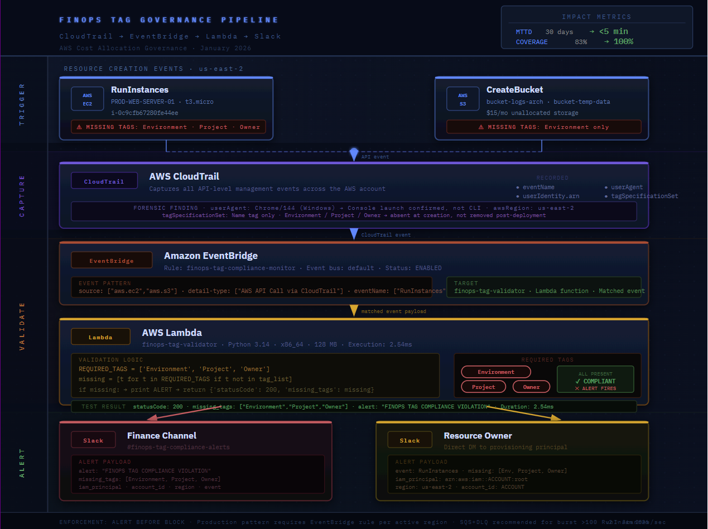
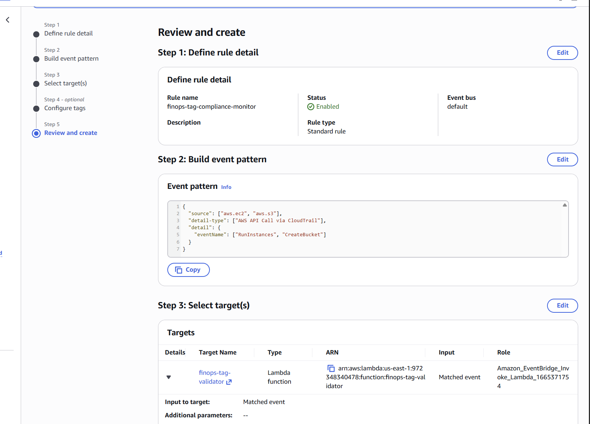
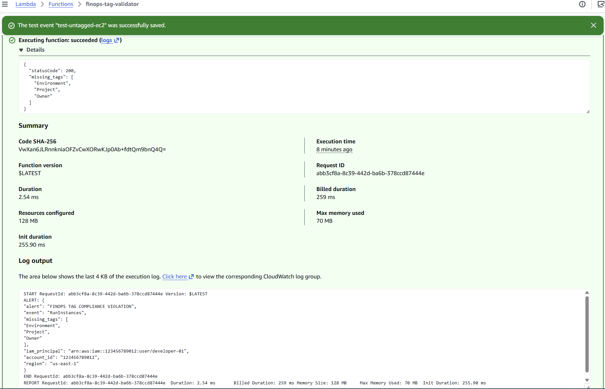

# AWS Cloud Governance and Cost Allocation Audit: Investigating a Tag Compliance Control Failure

*This is the full technical write-up. For the 5-minute version, see the summary README in my
other repo.*

> **Project context:** This is a self directed learning project completed in a personal AWS sandbox account, 
> not a professional engagement or paid consulting work. Cost figures are intentionally lab scaled ($315 
> total spend) so the investigation could be completed end to end without financial risk. Although 
> the environment is intentionally small, the investigation methodology, evidence collection approach, SQL 
> analysis, and governance decisions reflect the same control assessment practices used in larger enterprise 
> environments.

## Governance Focus

This portfolio demonstrates governance capabilities across cloud financial controls, asset attribution, 
audit evidence collection, control assessment, and 
operational risk reduction.

AWS provides the technical environment for the investigation. The transferable skills demonstrated 
throughout this work are evidence validation, control 
analysis, root cause investigation, governance decision making, and designing practical governance controls 
that strengthen operational accountability.

---

## Previous Compliance Experience

Before transitioning into cloud governance, I spent more than thirteen years working in regulated real 
estate transactions where every file had to reconcile against 
contracts, disclosures, and supporting documentation before it could close.

That experience shaped how I approached this investigation. Rather than treating missing resource tags as 
simply a technical issue, I approached them as an audit 
problem: reconcile financial records against operational evidence, identify where the control failed, 
determine why it failed, and recommend controls that reduce 
the likelihood of recurrence.

Although the technology is different, the underlying discipline is the same. Both environments require 
evidence based decision making, documentation accuracy, 
reconciliation, compliance, and repeatable controls that improve accountability rather than one time fixes.

---

## Portfolio Overview

This portfolio contains two cloud governance investigations that follow the same underlying approach: 
reconcile the system of record against operational evidence, 
identify where evidence diverges, determine why the control failed and how it should be strengthened, and 
design practical remediation.

The first investigation focuses on a cost allocation failure caused by missing resource tags. The second 
examines cross account spending patterns, financial 
controls, and commitment optimization using consolidated billing data.

Both investigations use a personal AWS environment, but the investigative methodology is intended to mirror 
governance and audit practices used in larger 
organizations.

The first case study demonstrates an investigation into a cloud cost allocation control failure. It follows 
the complete governance lifecycle from financial 
reconciliation through forensic investigation, root cause analysis, control design, and operational 
recommendations.

Across both investigations I follow the same audit methodology: validate the financial record, isolate the 
discrepancy, collect operational evidence, identify the control failure, quantify the business impact, and 
recommend a governance improvement proportional to the risk.

---

# Case Study 1: Investigating an AWS Cost Allocation Control Failure

A simulated monthly AWS reconciliation identified a 17% cost allocation gap. Although the invoice was 
accurate, $53 of the month's $315 spend could not be attributed to the required cost allocation tags, making 
it invisible to Finance chargeback reporting.

This investigation traces the evidence from the initial reconciliation through Athena analysis, CloudTrail 
forensics, root cause identification, and the design of an event driven detective control.


> **Key forensic finding:** CloudTrail evidence, specifically the `tagSpecificationSet` submitted with the 
> RunInstances API call, showed that the required tags were never included during provisioning. This 
> confirmed the issue originated during provisioning rather than being caused by post creation tag removal.

### A note on the screenshots

The screenshots capture different stages of the investigation and control development. Where screenshots 
reflect an earlier implementation, the accompanying text describes the final design and explains the changes 
made during refinement.

Athena screenshots use sanitized lab data and representative values. Queries, investigation steps, and evidence collection methods reflect the actual 
analysis workflow used during the investigation.

---

## Results at a Glance

| Metric | Before | After |
|---|---|---|
| Allocation coverage | ~83% | 100% |
| Mean time to detect (MTTD) | ~30 days | 1–5 minutes† |
| Detection method | Manual monthly reconciliation | Automated event-driven detection |
| Monthly unallocated spend | $53 | $0 |
| Annualized attribution gap | $636 | $0 |
| Finance reconciliation effort (manual) | ~4 hrs/month | Significantly reduced through automated detection workflow |
| Chargeback accuracy | Incomplete | Restored to 100% for affected cost centres |

†Lab-simulated outcome based on restored tag coverage; production impact is projected, not
measured. End-to-end latency is bounded by CloudTrail delivery plus EventBridge propagation, which
typically lands in the low-minute range but isn't a hard SLA.

This investigation addresses financial governance rather than cost reduction. AWS billed the spend 
correctly. The governance failure was the inability to attribute costs accurately for chargeback, 
forecasting, and financial accountability.

**Forward KPIs (post-control baselines):**

| Metric | Target | Measurement Method |
|---|---|---|
| Mean time to remediate (MTTR) | Under 24 hrs from alert | Tag compliance restored timestamp minus alert 
timestamp |
| Repeat violation rate | Below 10% within 30 days | Same principal ARN reappearing in violation events 
within a rolling 30-day window |
| Compliance trend | 95% within 60 days | Weekly tagged spend / total spend from Cost and Usage Report 
(CUR) |
| Tag validity rate | 90% within 60 days | Percentage of tag values matching an allowed value set, not just 
presence |

Detection alone does not demonstrate an effective control. Sustainable governance also requires clear 
ownership, defined remediation timelines, and measurable improvements through metrics such as MTTR, repeat 
violation rate, and long term compliance trends.

---

## What This Demonstrates

| Skill | Evidence |
|---|---|
| Reconciling a system of record against reality | Phases 1–4: Cost and Usage (CUR) Report NULL-tag filtering, row-level resource attribution |
| Audit-trail investigation | Phase 3: CloudTrail principal, identity chain, tagSpecificationSet |
| Control hierarchy reasoning | Control Hierarchy section: what enforces at design time vs. runtime vs. detection |
| Control selection and tradeoff reasoning | Appendix B: EventBridge vs. Config, detection vs. blocking, what was rejected and why |
| Blast radius quantification | Enterprise Context: $53 lab example scaled to a $10M/month environment |
| Finance-facing communication | Executive snapshot, AI-assisted formatting, chargeback sequencing |
| Building and testing the fix, not just recommending it | Deployed pipeline with a passing end-to-end test |

---

## Architecture

**Pipeline flow:** EC2 or S3 resource creation triggers CloudTrail to capture the API call.
EventBridge matches `RunInstances`, `CreateBucket`, and `PutBucketTagging` events. A Lambda
validates `Environment`, `Project`, and `Owner` tags, and alerts fire to Slack. The Finance
channel and the resource owner, simultaneously.



*End-to-end pipeline: resource creation, CloudTrail capture, EventBridge matching, Lambda
validation, dual Slack alerting. MTTD reduced from 30 days to 1–5 minutes; coverage restored
to 100%.*

```
EC2 RunInstances / S3 CreateBucket / S3 PutBucketTagging
             │
             ▼
        CloudTrail
             │
             ▼
    Amazon EventBridge
             │
             ▼
        AWS Lambda
   Checks: Environment · Project · Owner
             │                          │
             ▼                          ▼
  Slack: Finance Channel)   Slack:  Resource Owner
```

Config was evaluated as an alternative but rejected. Full reasoning is in Appendix B.

---

## Executive Snapshot

| | |
|---|---|
| **Problem** | A 17% AWS cost allocation gap. Spend was billed correctly, but missing required tags made part of the month's spend invisible to Finance chargeback reporting. |
| **Investigation** | Cost and Usage Report (CUR) data queried through Athena isolated the untagged resources. CloudTrail forensic analysis traced the root cause to console-launched resources where the required tags were never submitted during provisioning. |
| **Root Cause** | No preventive tagging control existed at resource creation. Contributing factors included limited identity attribution during provisioning and a Cost Allocation Tag activation dependency that would have prevented this investigation had the tags not already been enabled. |
| **Solution** | Implemented an event-driven detective control using CloudTrail, EventBridge, Lambda, and Slack notifications to Finance and the resource owner. |
| **Result** | Allocation coverage restored to 100%. Mean Time to Detect (MTTD) reduced from approximately 30 days to 1–5 minutes. Finance reconciliation effort was significantly reduced while restoring chargeback accuracy. |

**Operating model.** A governance control without defined ownership degrades over time. In production, responsibilities would be divided across three teams:

- **FinOps** owns the monitoring pipeline and governance KPIs (MTTR, repeat-violation rate, compliance trends).
- **Engineering** owns remediation of tagging violations within the agreed SLA.
- **Finance** consumes validated allocation data for chargeback, forecasting, and reporting.

---

## Control Assessment Result

| Control | Assessment |
|---|---|
| Mandatory cost allocation tagging | Failed |
| Preventive enforcement at provisioning | Not implemented |
| Detective monitoring | Implemented during remediation |
| Ownership attribution | Failed due to identity governance gap |

**Assessment:** The environment lacked a preventive tagging control at resource creation. 
Resources could enter production without required cost allocation metadata, resulting in 
unattributed spend and delayed Finance reconciliation.

**Control maturity before remediation:** Manual detection only.

**Control maturity after remediation:** Event-driven detective control with planned progressive enforcement.

---

## Technical Investigation Summary

| Phase | Objective | Outcome |
|---|---|---|
| 1. Invoice Validation | Confirm billing accuracy | Billing error ruled out |
| 2. Resource Isolation | Identify unallocated spend | EC2 and S3 gaps isolated |
| 3. CloudTrail Forensics | Identify creation source and identity chain | Console launch confirmed, tags 
absent at creation, no attributable identity |
| 4. Scope Expansion | Check for systemic exposure | Systemic gap confirmed across EC2 and S3 |
| 5. Remediation | Prevent recurrence | Detection pipeline live and tested |
| 6. Finance Reporting | Deliver executive output | Finance-ready governance report produced |

---

## Key Technologies

| Layer | Technology |
|---|---|
| Billing data | Cost and Usage Report (CUR) |
| Query engine | Amazon Athena |
| Forensics | CloudTrail |
| Event capture | Amazon EventBridge |
| Tag validation | AWS Lambda (Python) |
| Governance | AWS Organizations Tag Policies, SCP |
| Alerting | Slack |
| Reporting | (AI-assisted formatting only; findings produced by SQL and CloudTrail analysis) |

---

## Technical Investigation

### Context

The investigation began at monthly reconciliation. Total AWS spend was $315. Spend visible with
required tags was $262, leaving $53, approximately 17%, unallocated. The invoice was accurate. The
failure was in attribution, not billing.

---

### Phase 1: Invoice Validation

I first tested whether this was simply a billing error, which would make it a Finance reporting
artifact rather than an infrastructure problem. I validated service totals in Cost Explorer,
reconciled them against Cost and Usage Report (CUR) via Athena, and confirmed the totals matched exactly. 
Billing was
correct, which ruled out the simplest explanation and pushed the investigation to the resource
level.


> **Query reproduction note:** The screenshot uses a `VALUES` clause to simulate Athena output for
> the portfolio. The production-equivalent query aggregates `SUM(line_item_unblended_cost)` by
> `line_item_product_code` from live Cost and Usage Report (CUR) Parquet files and reconciles against the 
> invoice PDF.

### Phase 2: Resource Isolation (Cost and Usage Report (CUR) Analysis)

I selected the Cost and Usage Report (CUR) queried through Athena rather than Cost Explorer because CUR provides row-level billing records with 
individual resource tag columns. Cost Explorer is optimized for aggregated financial reporting, whereas CUR supports forensic investigation by 
exposing detailed resource attribution data required for reconciliation. Unblended cost was used throughout because it aligns with Finance's 
authoritative billing source of truth.

Before running this analysis, the `Environment`, `Project`, and `Owner` tags first had to be activated as AWS Cost Allocation Tags in the Billing 
console. Without this prerequisite, those columns would not exist in the Cost and Usage Report (CUR) schema, causing NULL-tag analysis to return 
incomplete results despite the tags existing on resources.

```sql
SELECT
    line_item_resource_id,
    resource_tags_user_environment,
    resource_tags_user_project,
    resource_tags_user_owner,
    SUM(line_item_unblended_cost) AS total_cost
FROM cur_database.aws_cur
WHERE line_item_line_item_type = 'Usage'
GROUP BY 1, 2, 3, 4
ORDER BY total_cost DESC;
```

The turning point in the investigation came when resource `i-0c9cfb67280fe44ee` returned NULL values across all three required tag columns on every 
billing record. A single missing tag could reasonably be attributed to human error. Three consistently missing tags across every CUR record strongly 
indicated the resource had been provisioned without the organization's required tagging standard. That shifted the investigation from financial 
reconciliation toward infrastructure forensics using CloudTrail.

**Sample query output:**

| Instance Name | Instance ID | Instance Type | Monthly Cost | Environment | Project | Owner |
|---|---|---|---|---|---|---|
| PROD-WEB-SERVER-01 | i-0c9cfb67280fe44ee | t3.large | 40.00 | NULL | NULL | NULL |


> **Instance type note:** CloudTrail records `t3.micro` at creation time; Cost and Usage Report (CUR) 
> reflects `t3.large`
> as the billed type. CloudTrail is the source of truth for what was submitted at provisioning.
> Cost and Usage Report (CUR) reflects current billing state. Any discrepancy between the two triggers a 
> secondary check
> (see Phase 3, Step 3).

**Production-equivalent query** (partitioned by month and account, filtered on any of the three
required tags being NULL):

```sql
SELECT
    line_item_usage_account_id,
    line_item_product_code,
    line_item_resource_id,
    DATE_TRUNC('month', line_item_usage_start_date)  AS billing_month,
    SUM(line_item_unblended_cost)                    AS total_cost,
    resource_tags_user_environment,
    resource_tags_user_project,
    resource_tags_user_owner
FROM cur_table
WHERE
    line_item_line_item_type = 'Usage'
    AND line_item_usage_start_date BETWEEN DATE '2026-01-01' AND DATE '2026-01-31'
    AND (
        resource_tags_user_environment IS NULL
        OR resource_tags_user_project  IS NULL
        OR resource_tags_user_owner    IS NULL
    )
GROUP BY 1, 2, 3, 4, 6, 7, 8
ORDER BY total_cost DESC;
```

`line_item_usage_account_id` is what lets this same query trace attribution gaps across 50–200
accounts in a consolidated Organizations CUR dataset.

---

### Phase 3: CloudTrail Forensic Investigation

**Objective:** determine how and why the resource was created without tags, was it never tagged,
or tagged and later stripped?

CloudTrail was the right tool because it captures request *intent*, including the
`tagSpecificationSet` submitted with the API call, something a post-state resource evaluation
(like AWS Config) can't reconstruct. Config records what a resource looks like after creation;
CloudTrail records what was actually asked for at the moment of creation. For a tagging
investigation, that's the difference between knowing tags are missing and knowing they were never
submitted.

I filtered CloudTrail Event history to `RunInstances` and opened the full JSON event for
`i-0c9cfb67280fe44ee`.


The `tagSpecificationSet` contained only the `Name` tag (`PROD-WEB-SERVER-01`). `Environment`,
`Project`, and `Owner` were never submitted with the API call. Confirming the tags were absent at
creation, not applied and later removed.This distinction changed the remediation decision: the issue required a provisioning control improvement rather 
than a cleanup process.

**Data integrity check (Step 3):** the CloudTrail-recorded instance type (`t3.micro`) doesn't match
the Cost and Usage Report (CUR) billed type (`t3.large`) for this same resource. In a live investigation 
this triggers a
short secondary check: query CloudTrail for `ModifyInstanceAttribute` events on the same resource
to rule out a post-launch change, and confirm the Cost and Usage Report (CUR) processing interval aligns 
with the
CloudTrail timestamp. CloudTrail remains the source of truth for creation-time intent regardless.
In this lab, the values across screenshots were captured at different simulation stages and
aren't meant to align perfectly, the reconciliation technique is what's transferable.

**Session attribution, The identity finding (Step 4):**

```json
"userIdentity": {
  "type": "Root",
  "sessionContext": {
    "attributes": {
      "creationDate": "2026-01-22T13:17:47Z",
      "mfaAuthenticated": "true"
    }
  }
}
```

The session record has no `sessionIssuer`, no role-assumption chain, and no federation context. I
also queried CloudTrail for `AssumeRole` events scoped to this principal in the 30 minutes before
the `RunInstances` call, none returned. So this wasn't a role assumed and then used; there was no
attributable identity chain at any layer.

That matters independently of the tagging gap: even with correct tags, there's no way to route
accountability to a specific team or approval workflow, because no `sessionIssuer` means no team
ownership is resolvable after the fact. In a security review this would be logged as a separate
identity governance finding alongside the tagging failure. Both existed within the same
ungoverned provisioning surface.

> **Note on the IAM principal used in this lab:** Root with MFA was used deliberately to simulate
> a worst-case scenario with no identity boundary at the provisioning layer. In a real enterprise
> environment root is typically locked via SCP; the production equivalents are a broad-permission
> developer role launching via console, a federated SSO user working outside an IaC pipeline, or a
> break-glass role used outside a change window. The forensic technique, UserAgent analysis plus
> `tagSpecificationSet` inspection, applies identically to all of those.

**Forensic evidence chain summary:**

| Evidence | Finding |
|---|---|
| Cost and Usage Report (CUR) (Phase 2) | Untagged resource, instance ID, $40/month cost |
| CloudTrail JSON | Root principal, no sessionIssuer or federation context, console launch confirmed via 
Chrome UserAgent |
| CloudTrail JSON (tag section) | `tagSpecificationSet` had only `Name`; the three required tags were absent 
at creation |
| Session attribution | Zero `AssumeRole` events in the 30-minute pre-incident window. No role chain, no 
federation context |

---

### Phase 4: Expanding Scope to S3

**Objective:** confirm whether this was isolated or systemic.

| Service | Billed | Allocated | Gap |
|---|---|---|---|
| EC2 | $220 | $182 | ~$38 |
| RDS | $60 | $60 | $0 |
| S3 | $35 | $20 | $15 |

EC2 had the largest gap, but S3 confirmed the issue was systemic. Both non-compliant buckets had
`Project` and `Owner` present but were missing `Environment`. A reminder that partial tagging
produces the same Finance-invisible result as no tagging at all.

| Resource ID | Monthly Cost | Environment | Project | Owner |
|---|---|---|---|---|
| bucket-logs-arch | $7.00 | NULL | data-pipeline | team-ops |
| bucket-temp-data | $8.00 | NULL | web-app | team-engineering |
| **TOTAL UNALLOCATED** | **$15.00** | | | |


**S3's asynchronous tagging behavior matters here.** S3's `CreateBucket` API doesn't accept tags
inline the way EC2 does. Tags are applied afterward via `PutBucketTagging`. That creates a short
window where a bucket exists in a technically non-compliant state even if it will be tagged
correctly within seconds. The production control accounts for this with dual-event monitoring
(`CreateBucket` and `PutBucketTagging`) plus a delayed validation Lambda as a safety net for
buckets where tagging never happens. Many organizations solve this upstream instead, through
Service Catalog products or IaC modules that enforce tags before a bucket can be created at all,
which removes the window entirely.

---

## Governance Decision

The technical recommendation was not simply to purchase additional Savings Plans. The governance decision 
depended on distinguishing sustained demand from a 
temporary workload. Committing against a one time spike would improve short term utilization metrics but 
increase long term financial risk if demand returned to 
baseline.

The recommended approach was therefore to increase coverage conservatively while validating workload 
recurrence with the data engineering team before expanding 
commitments further. This balances cost optimization against commitment risk and aligns Finance, 
Engineering, and Cloud Operations around a common decision 
framework.

## Root Cause and Remediation

| | |
|---|---|
| **Primary failure** | No preventive tagging control at resource creation |
| **Contributing factor 1** | No attributable identity chain |
| **Contributing factor 2** | Tag activation dependency with no verification step |
| **Result** | Unattributed spend and no enforceable ownership model |

The sandbox environment had no SCP, IAM condition key, IaC guardrail, or curated provisioning interface 
requiring tags at creation. That was the direct cause. The 
missing identity chain didn't cause the tagging failure, but it removed the ability to assign ownership or 
design targeted enforcement around a known principal. 
Tagging makes spend allocatable. Identity makes it attributable. This environment had weaknesses in both.

**Design choice: visibility over false accuracy.** I evaluated and rejected an auto-remediation
Lambda that would apply default tags on detection. Default tags produce chargeback reports that
assign cost to the wrong team and distort the whole downstream FinOps model. The safer approach
was to surface the gap accurately, alert the resource owner, and let the actual owner apply the
correct tags. Full reasoning in Appendix B.

---

## Control Hierarchy: Where Detection Fits

This addresses the *detection* stage of a governance maturity model (Visibility → Standardization → Detection → Prevention). Detection generally 
precedes broad enforcement, but not always. Many real environments already have baseline SCPs from day one (denying root usage, for example), and
scoped enforcement can coexist with detection early where the environment is well understood.

| Layer | What it enforces | Notes |
|---|---|---|
| **IaC (Terraform, etc.)** | Design time | Strongest first control. A plan without required tags simply 
fails before anything reaches AWS |
| **Curated provisioning interfaces** (Backstage, ServiceNow, Service Catalog) | Provisioning entry point | 
Enforces tagging by construction before any API call is 
made |
| **SCP / IAM condition keys** | Request time | Effective when scoped narrowly to known roles; blanket 
org-wide enforcement without a baseline breaks AWS-managed 
service roles (EMR, ECS, Auto Scaling) |
| **Tag Policies** | Schema only | Standardizes tag *names* across accounts; doesn't block anything |
| **EventBridge + Lambda** | Detection | Catches out-of-band activity even where IaC and curated 
provisioning exist. Break-glass access, ad hoc scripts, 
incident-response console use |
| **Selective SCP rollout** | Enforcement, after baseline | Applied org-wide only once exceptions are mapped. Applied too early it erodes engineering trust in every governance initiative that follows |

A production SCP implementation would enforce required request tags at provisioning time, but only after the organization has established a tagging 
baseline, mapped exceptions, and validated required workflows. SCPs should be treated as permission boundaries rather than tagging systems themselves; 
effective enforcement depends on IAM request conditions, supported AWS services, and exception management.

Example enforcement sequence:

1. Detect current compliance gaps using CUR, CloudTrail, and EventBridge.
2. Establish required tag standards using Tag Policies.
3. Identify approved exceptions such as AWS managed services, automation roles, and break glass workflows.
4. Apply scoped SCP or IAM condition key enforcement to new workloads.
5. Expand enforcement after compliance stabilizes above the agreed threshold.

The control decision is not whether enforcement is technically possible; it is determining when enforcement 
reduces risk rather than creating operational disruption.
---

## Remediation and Controls

**Immediate:** applied the missing tags manually so Finance could close the month accurately. No
restatements required.

**Permanent, in progressive stages:**
1. Tag Policies standardize required tag keys across accounts without blocking anything.
2. EventBridge + Lambda detect violations within minutes and alert Finance and the resource owner.
3. SCP guardrails enforce compliance for greenfield accounts once coverage stabilizes above 95%,
   grandfathering existing workflows.

The EventBridge rule filters `RunInstances`, `CreateBucket`, and `PutBucketTagging`:

```json
{
  "source": ["aws.ec2", "aws.s3"],
  "detail-type": ["AWS API Call via CloudTrail"],
  "detail": {
    "eventName": ["RunInstances", "CreateBucket", "PutBucketTagging"]
  }
}
```



> The screenshot reflects an earlier build (`RunInstances` and `CreateBucket` only). S3 validation
> was later moved to `PutBucketTagging` once I identified the temporal compliance window described
> above — validating at `CreateBucket` would flag every new bucket as non-compliant regardless of
> its eventual tag state.

The Lambda branches EC2 and S3 differently, since each service exposes tag data at a different
point in its lifecycle — EC2 tags arrive inline with `RunInstances`, S3 tags arrive later via
`PutBucketTagging`. Each alert carries the missing tags, the IAM principal ARN, account, and
region, so the Finance channel gets notified immediately while the owner-routing logic resolves
the responsible team separately.


> **Iteration note:** an earlier version of this Lambda tried to read S3 tags directly off the
> `CreateBucket` event using lowercase keys, which doesn't work — `CreateBucket` doesn't carry
> inline tags, and CloudTrail uses PascalCase for S3 parameters (`Tagging`, `TagSet`, `Tag`). The
> version above fixes both issues. It's a small bug, but it's the kind that quietly generates false
> positives on every single new bucket until someone notices engineers have started ignoring the
> alert.


**Test result — CloudWatch log output:**

```
ALERT: {
  "alert": "FINOPS TAG COMPLIANCE VIOLATION",
  "event": "RunInstances",
  "missing_tags": ["Environment", "Project", "Owner"],
  "iam_principal": "arn:aws:iam::123456789012:user/developer-01",
  "account_id": "123456789012",
  "region": "us-east-1"
}
```



**Escalation:** if remediation doesn't happen within the 24-hour SLA, the owning team's manager
gets a second-stage alert. Repeat violations by the same principal within 30 days trigger a
governance review rather than another alert, to avoid alert fatigue.

At production scale, the main things a sandbox doesn't surface are regional deployment (EventBridge
rules are regional, so a rule has to be deployed to every active region), Lambda concurrency limits
under bursty provisioning (solved with an SQS buffer and DLQ), and Cost and Usage Report (CUR) partition 
management once
you're past 100+ accounts. All three are addressed in the days-1-30 plan below rather than in the
lab build itself.

---

## What I Would Do Next

**Days 1–30:** deploy the rule and Lambda to all active regions via IaC, add the delayed
validation Lambda for untagged S3 buckets, add an SQS/DLQ buffer for burst hardening, and stand up
basic pipeline monitoring (regional rule audit, DLQ alarm, monthly synthetic alert test).

**Days 31–60:** centralize Cost and Usage Report (CUR) across accounts, stand up a weekly tag-compliance KPI 
as a
first-class metric, and start tracking MTTR and repeat-violation rate per team.

**Days 61–90:** introduce SCP guardrails for greenfield accounts once compliance exceeds 95%, move
Finance from showback to full chargeback, and run the rightsizing and Savings Plans analysis that
attribution now makes possible (see Case Study 2).

---

## Lessons Learned

- Financial data has to be treated as operational telemetry, without near-real-time visibility,
  allocation failures sit undetected until month-end close.
- Root causes at this scale are rarely isolated to a single failure. The provisioning gap, the tag-activation
  dependency, and the identity gap are three separate problems that happened to compound.
- Early in a governance program, rapid detection often changes behavior faster than broad enforcement.   
  Immediate feedback beats a blocked deployment that just gets routed around.
- Tag Policies standardize schema; they don't enforce anything. Knowing what each control tier
  actually does is what keeps you from mistaking visibility for protection.
- Attribution has to come before optimization. Sizing a rightsizing or Savings Plans
  recommendation against unattributed spend just produces a wrong number with more confidence
  behind it.

---

## Appendix A: Reporting Methodology

AI tools were used for report formatting and editing. All findings, SQL analysis, forensic investigation, 
architectural decisions, and conclusions were independently produced and validated against the underlying AWS evidence.

**1. Executive Summary**

A forensic investigation identified a 17% cost allocation gap across EC2 and S3. The primary
failure was the absence of preventive tagging enforcement at resource creation, with two
contributing factors: a tag activation dependency with no verification process, and an identity
gap with no attributable provisioning chain. An event-driven detection pipeline has been
implemented, restoring 100% allocation visibility and reducing end-to-end detection time to 1–5 minutes.

**2. Financial Impact**

| Metric | Value |
|---|---|
| Allocation gap | 17% of total spend |
| Monthly unallocated spend | $53 |
| Annualized if unresolved | $636 |
| Chargeback accuracy | Restored to 100% for affected cost centres |
| MTTD before / after | ~30 days → 1–5 minutes |
| Blast radius at $10M/month (5% failure rate) | $500K/month, $6M annualized |

**3. Remediation Plan**

*Immediate:* tags applied manually; Finance closed the month with 100% allocation accuracy, no
restatements needed. *Permanent:* CloudTrail → EventBridge → Lambda → Slack pipeline deployed
with EC2/S3 branching; SCP guardrails planned for greenfield accounts once compliance exceeds 95%.

---

## Appendix B: Control Selection Rationale

The decision to detect rather than block reflects a governance-maturity judgment call, not a
technical limitation.

**What I rejected, and why:**

- **IAM condition keys as a universal control** — valid when scoped to specific developer roles,
  but AWS-managed services (EMR, ECS, Auto Scaling) often don't pass required tags through
  consistently. Blanket enforcement before mapping those exceptions creates more overhead than it
  removes.
- **AWS Config** — Config evaluates resulting resource state; it can't see the intent behind the
  original API call the way CloudTrail's `tagSpecificationSet` can. Config cost also scales with
  configuration-item recording across every resource in every account, which compounds fast in a
  multi-account Organization.
- **Immediate SCP enforcement** — would close the gap on day one, but in an environment with no
  existing baseline, a blocking SCP breaks an unknown number of CI/CD pipelines and developer
  workflows before anyone's mapped the exceptions.
- **Auto-remediation (default tags on detection)** — closes the reporting gap fastest, but
  corrupts the whole downstream model: chargeback assigns cost to the wrong team, showback gives
  engineers a false picture of their own usage, and anomaly detection ends up running against the
  wrong baseline. That's worse than an unallocated-but-visible gap, because it creates false
  confidence instead of a flag Finance can act on.

**Sequence:** detect now → targeted prevention (SCP on greenfield accounts, IAM conditions for
repeat-violator roles) once compliance hits ~95% → broad SCP rollout with a grace period once the
full baseline is mapped.

---

## Appendix C: Enterprise Context and Scale

The $53 gap here is a methodology demonstration; the financial risk it represents isn't. At $10M
per month across 150 accounts, a 5% allocation failure rate is $500K/month Finance can't see or
charge back, $6M a year. At that scale it stops being a reporting gap and becomes a strategic
planning failure: budget models are wrong, team accountability is broken, and Savings Plans
commitments get sized against incomplete data.

The same Cost and Usage Report (CUR) query structure, CloudTrail forensic chain, and EventBridge pipeline 
demonstrated
here would surface and prevent that gap the same way. The main differences at enterprise scale are  
operational: EventBridge rules per region, Cost and Usage Report (CUR) partitioning by account and month, 
Lambda concurrency buffering, and tag-key normalization across accounts that haven't standardized on 
`Environment` vs. `env` vs. `environment` (each produces a separate NULL pattern in Cost and Usage Report 
(CUR) until it's fixed via Tag Policies).

A multi-account rollup query, for reference:

```sql
SELECT
    line_item_usage_account_id,
    line_item_product_code,
    COUNT(DISTINCT line_item_resource_id)    AS untagged_resource_count,
    SUM(line_item_unblended_cost)            AS unallocated_spend,
    ROUND(100.0 * SUM(line_item_unblended_cost) /
        SUM(SUM(line_item_unblended_cost)) OVER (), 2)  AS pct_of_total
FROM cur_database.consolidated_cur
WHERE line_item_line_item_type = 'Usage'
    AND line_item_usage_start_date BETWEEN DATE '2026-01-01' AND DATE '2026-01-31'
    AND (resource_tags_user_environment IS NULL
      OR resource_tags_user_project  IS NULL
      OR resource_tags_user_owner    IS NULL)
GROUP BY 1, 2
ORDER BY unallocated_spend DESC;
```

Rollout sequencing in a real multi-account environment usually means enforcing first on the
accounts with the highest unallocated spend, and holding off on low-spend dev environments until
a later wave. Shared infrastructure VPCs, transit gateways, NAT gateways. Has no single owner,
so any chargeback split for those needs to be agreed on before tagging is meaningful at all.

---

## Appendix D: Pipeline Failure Modes

A detection pipeline that silently stops working looks identical to a clean environment until the
next reconciliation reveals a gap it should have caught weeks earlier. The failure modes worth
monitoring for: alert fatigue from false positives (the branching logic and `PutBucketTagging`
deferral exist specifically to avoid this), EventBridge rules not yet deployed to a newly-active
region, Lambda concurrency exhaustion during a provisioning burst, someone disabling CloudTrail
logging itself, and a Slack webhook silently failing while Lambda reports success. Each of these
is addressed with a specific, cheap check. A weekly region audit, a DLQ depth alarm, a
`StopLogging`/`DeleteTrail` CloudWatch alarm, and a monthly synthetic end-to-end alert test.

| Failure Mode | Detection Method |
|---|---|
| Alert fatigue / false positives | Alert-to-action ratio monitoring |
| Regional rule gap | Weekly automated region audit |
| Lambda concurrency exhaustion | CloudWatch DLQ depth alarm |
| CloudTrail disruption | CloudWatch alarm on StopLogging/DeleteTrail |
| Slack webhook failure | Monthly synthetic end-to-end test |
| Tag schema drift | Change control tying `REQUIRED_TAGS` to the tag activation step |

---

---

# Case Study 2: Cross-Account EC2 Cost Spike and Savings Plans Coverage Gap

A week-over-week EC2 cost spike of 34% ($18,400 above baseline) across three linked accounts
triggered a Finance escalation five days before month-end. This investigation demonstrates how a governance 
analyst can investigate a simulated EC2 cost anomaly, identify contributing control gaps, and assess 
commitment optimization opportunities.


## Results at a Glance

| Metric | Finding |
|---|---|
| Spike magnitude | $18,400 above 4-week baseline, 34% week-over-week increase |
| Root cause | Unplanned batch workload in a dev account, running full On-Demand rate |
| Savings Plans coverage before spike | 61% of eligible On-Demand spend |
| Optimal coverage target (modeled) | 78% |
| Recommended commitment | $4,200/month, 1-year, No Upfront Compute Savings Plan |
| Projected monthly savings | ~ $1,585 (~$19,000/year), 27.4% discount vs. On-Demand |
| Break-even | Month 1 |

## Technical Investigation

**Phase 1 — anomaly isolation.** A week-over-week Cost and Usage Report (CUR) comparison across the 
consolidated billing
account isolated the spike to Account B (dev), concentrated in compute-optimized instance
families:

```sql
WITH weekly AS (
    SELECT line_item_usage_account_id, line_item_product_code, line_item_usage_type,
           DATE_TRUNC('week', line_item_usage_start_date) AS usage_week,
           SUM(line_item_unblended_cost) AS weekly_cost
    FROM cur_database.consolidated_cur
    WHERE line_item_line_item_type = 'Usage'
      AND line_item_product_code = 'AmazonEC2'
      AND line_item_usage_start_date BETWEEN DATE '2026-03-01' AND DATE '2026-03-31'
    GROUP BY 1, 2, 3, 4
),
comparison AS (
    SELECT line_item_usage_account_id, line_item_usage_type,
           MAX(CASE WHEN usage_week = DATE '2026-03-16' THEN weekly_cost END) AS week_prior,
           MAX(CASE WHEN usage_week = DATE '2026-03-23' THEN weekly_cost END) AS week_current
    FROM weekly GROUP BY 1, 2
)
SELECT *, week_current - week_prior AS delta,
       ROUND(100.0 * (week_current - week_prior) / NULLIF(week_prior, 0), 1) AS pct_change
FROM comparison WHERE week_current > week_prior ORDER BY delta DESC LIMIT 20;
```

| Account | Usage Type | Week Prior | Week Current | Delta | % Change |
|---|---|---|---|---|---|
| Account B (dev) | EC2:c5.4xlarge-BoxUsage | $2,100 | $16,800 | +$14,700 | +700% |
| Account B (dev) | EC2:c5.2xlarge-BoxUsage | $880 | $4,580 | +$3,700 | +420% |
| Account A (prod) | EC2:m5.xlarge-BoxUsage | $9,200 | $9,430 | +$230 | +2.5% |

**Phase 2 — CloudTrail confirmation.** Filtering `RunInstances` for Account B in the spike window
showed a batch workload (`arn:.../role/data-eng-batch-role`, CLI, tagged
`Project: ml-training-batch-march`) launched with no corresponding budget alert or capacity
pre-approval in that dev account. Root cause: absent budget guardrails let an unplanned compute
burst reach billing without Finance visibility until the consolidated threshold fired five days
later.

**Phase 3 — Savings Plans coverage gap.** The spike surfaced a second, pre-existing finding: the
commitment position was undersized relative to real On-Demand run rate across all three accounts.

| Account | Eligible On-Demand | SP Applied | Coverage % |
|---|---|---|---|
| Account A (prod) | $98,000 | $63,700 | 65% |
| Account B (dev) | $22,000 | $11,440 | 52% |
| Account C (staging) | $12,000 | $6,720 | 56% |
| **Total** | **$132,000** | **$81,860** | **62%** |

62% coverage means $50,140/month was running at full On-Demand rate. The 78% target reflects the
steady-state baseline minus two buffers. The recommendation intentionally avoids optimizing for maximum 
discount coverage because commitment decisions should preserve flexibility for workload volatility. : 10% 
for organic growth over the commitment term, and 12% for variable dev-account batch workloads that shouldn't 
be committed against.

**Phase 4 — sizing and break-even.** Compute Savings Plans fit better than EC2 Instance SPs here
because the prod account spans multiple instance families and two regions, and Compute SPs apply
discount across family, size, OS, and region.

| Parameter | Value |
|---|---|
| Commitment | $4,200/month, 1-year, No Upfront |
| Effective rate | $5.81/hr vs. $8.00/hr On-Demand (c5 family) |
| Discount | 27.4% |
| Minimum utilization to avoid waste | 72.8% |

At a 27.4% discount, a $4,200/month commitment covers about $5,785/month of on-demand-equivalent
usage. So the commitment itself saves roughly $1,585/month, or **about $19,000/year**, against
the current baseline. That leaves the bulk of the $50,140/month exposure still uncovered; closing
more of that gap means sizing additional commitments in later waves as the compliance baseline and
utilization data mature, not committing the full amount at once. If the batch workload recurs
monthly and a larger commitment is warranted, a $6,800/month tranche at the same discount rate
would add roughly $31,000/year on top. Noted as a scenario, not the current recommendation, since
sizing to a one-time spike would overcommit if it doesn't recur.

**Finance deliverable (summary):** the current SP position covers 62% of eligible spend, leaving
$50,140/month exposed. A $4,200/month Compute SP is projected to save roughly $19,000/year at
current run rates, breaking even in Month 1. Recommend approval at this level pending confirmation from the 
data engineering team on whether the batch workload is a one time run or a recurring monthly job. Committing 
against a temporary spike would improve short term utilization metrics but increase long term financial risk 
if demand returns to baseline.

That demonstrates you can defend your recommendation during Finance discussions.

## Lessons Learned

- A 20% week-over-week threshold caught the spike, but five days into the billing period. Account-level AWS 
  Budgets alerts at 80%/100% of forecast would have 
  caught it in real time.
- Savings Plans coverage gaps stay invisible in routine reporting until a burst exposes them.
- Commitment sizing needs a steady-state baseline, not a peak. Sizing to the spike month
  overcommits if it doesn't recur.
- Dev accounts need budget guardrails as much as prod does; this one had SCPs and budget alerts in
  prod but neither in dev, which is a common gap wherever active ML or data engineering teams sit
  in a less-governed account.

---

## Portfolio Summary

These investigations demonstrate how governance work extends beyond cloud configuration into financial 
accountability, operational controls, evidence based investigation, and cross functional decision making.

While completed in a personal AWS environment, the investigations apply enterprise governance principles 
including reconciliation, forensic analysis, control assessment, risk evaluation, and governance driven 
remediation.

My objective is not to demonstrate knowledge of every AWS service. It is to demonstrate the governance 
thinking, investigative discipline, and evidence based decision making required to identify control 
failures, communicate findings clearly, and recommend practical improvements that strengthen financial 
accountability.

